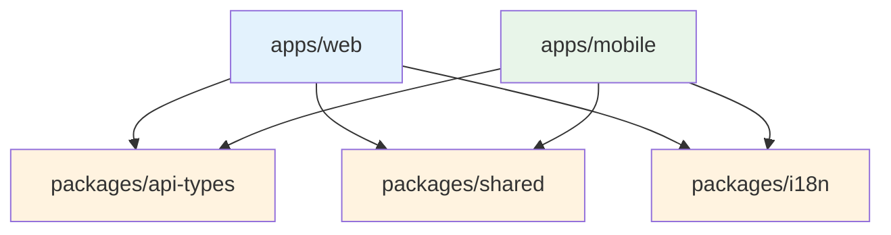

# Monorepo Strukturasi

> **Versiya:** 1.0  
> **Yangilangan:** 2026-01-19

---

## Maqsad

Aishunos loyihasi **pnpm workspace** asosidagi monorepo arxitekturasidan foydalanadi. Bu hujjat loyiha tuzilishi va paketlar orasidagi bog'liqliklarni tavsiflaydi.

---

## Loyiha Strukturasi

```
news-app-monorepo/
├── apps/                          # Ilovalar
│   ├── web/                       # Next.js web application
│   └── mobile/                    # Expo/React Native mobile app
│
├── packages/                      # Shared paketlar
│   ├── api-types/                 # TypeScript type definitions
│   ├── i18n/                      # Internationalization
│   └── shared/                    # Shared utilities
│
├── prisma/                        # Database
│   ├── schema.prisma              # Prisma schema
│   └── seed.ts                    # Seed data
│
├── docs/                          # Hujjatlar
│
├── package.json                   # Root package.json
├── pnpm-workspace.yaml            # Workspace konfiguratsiyasi
└── vercel.json                    # Vercel deployment
```

---

## Apps (Ilovalar)

### `apps/web` - Next.js Web Application

| Xususiyat | Qiymat |
|-----------|--------|
| **Package nomi** | `@news-app/web` |
| **Framework** | Next.js 16.1.1 |
| **Port** | 3000 |
| **Vazifasi** | Asosiy web sayt, API, Admin panel |

**Ichki struktura:**
```
apps/web/
├── src/
│   ├── app/                       # Next.js App Router
│   │   ├── [locale]/(web)/        # Public web sahifalar
│   │   ├── [locale]/tg/           # Telegram Mini App
│   │   ├── admin/                 # Admin panel
│   │   └── api/                   # API routes
│   ├── components/                # React komponentlar
│   ├── lib/                       # Utilities, services
│   │   └── news/                  # News pipeline
│   └── i18n/                      # Internationalization
├── messages/                      # Locale fayllar (uz, ru, en)
└── public/                        # Static assets
```

### `apps/mobile` - React Native/Expo Mobile App

| Xususiyat | Qiymat |
|-----------|--------|
| **Package nomi** | `@news-app/mobile` |
| **Framework** | Expo 54, React Native 0.81 |
| **Vazifasi** | iOS/Android mobile ilova |

**Ichki struktura:**
```
apps/mobile/
├── src/
│   ├── api/                       # API client
│   ├── hooks/                     # Custom hooks
│   ├── navigation/                # React Navigation
│   ├── screens/                   # Screen komponentlar
│   ├── store/                     # Zustand store
│   └── theme/                     # Theming
└── assets/                        # Rasmlar, ikonkalar
```

---

## Packages (Shared Paketlar)

### `packages/api-types`

| Xususiyat | Qiymat |
|-----------|--------|
| **Package nomi** | `@news-app/api-types` |
| **Vazifasi** | TypeScript interfeyslari |

**Eksportlar:**
- `Article`, `ArticleListItem` - Maqola tiplari
- `Category`, `Tag` - Kategoriya tiplari
- `Difficulty`, `Importance` - Enum tiplar
- `PaginatedResponse` - Pagination tipi

### `packages/shared`

| Xususiyat | Qiymat |
|-----------|--------|
| **Package nomi** | `@news-app/shared` |
| **Vazifasi** | Utility funksiyalar, konstantalar |

**Eksportlar:**
- `formatDate()` - Sana formatlash
- `truncate()` - Matn qisqartirish
- `slugify()` - Slug generatsiya
- `cn()` - Class names birlashtirish
- `SITE_CONFIG` - Sayt konfiguratsiyasi
- `getShareUrls()` - Social share URLs

### `packages/i18n`

| Xususiyat | Qiymat |
|-----------|--------|
| **Package nomi** | `@news-app/i18n` |
| **Vazifasi** | Shared locale fayllar |

---

## Workspace Konfiguratsiyasi

### `pnpm-workspace.yaml`

```yaml
packages:
  - apps/*
  - packages/*

ignoredBuiltDependencies:
  - sharp
  - unrs-resolver

nodeLinker: hoisted
```

### Package Dependencies



---

## Scriptlar

### Root `package.json`

| Script | Vazifasi |
|--------|----------|
| `pnpm dev` | Web va Mobile parallel ishga tushirish |
| `pnpm build` | Barcha paketlarni build qilish |
| `pnpm lint` | Barcha paketlarda linting |
| `pnpm type-check` | TypeScript tekshiruvi |

### Web-specific

```bash
pnpm --filter @news-app/web dev      # Faqat web
pnpm --filter @news-app/web build    # Web build
```

### Mobile-specific

```bash
pnpm --filter @news-app/mobile dev   # Expo start
pnpm --filter @news-app/mobile ios   # iOS simulator
pnpm --filter @news-app/mobile android # Android emulator
```

---

## Import Qoidalari

### ✅ To'g'ri

```typescript
// Web app'da shared package'dan import
import { formatDate, SITE_CONFIG } from '@news-app/shared';
import type { Article } from '@news-app/api-types';

// Mobile app'da
import { truncate } from '@news-app/shared';
import type { ArticleListItem } from '@news-app/api-types';
```

### ❌ Noto'g'ri

```typescript
// Apps bir-biridan import qila olmaydi!
import { something } from '@news-app/web'; // XATO!
import { other } from '@news-app/mobile';  // XATO!
```

---

## Bog'liq Hujjatlar

- [Arxitektura](./README.md) - Texnologiyalar
- [Kod Standartlari](./CODING_STANDARDS.md) - Kod qoidalari
- [Web App](../platforms/WEB_APP.md) - Next.js hujjati
- [Mobile App](../platforms/MOBILE_APP.md) - Expo hujjati

